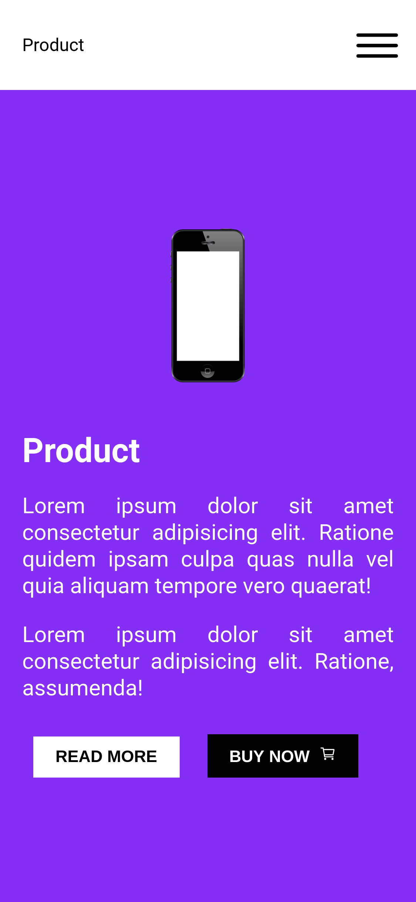

[![Contributors][contributors-shield]][contributors-url]
[![Forks][forks-shield]][forks-url]
[![Stargazers][stars-shield]][stars-url]
[![Issues][issues-shield]][issues-url]
[](https://github.com/krystianfluder/landing-page/blob/master/LICENSE)
[![LinkedIn][linkedin-shield]][linkedin-url]

<!-- PROJECT LOGO -->
<br />
<p align="center">
  <a href="https://github.com/krystianfluder/landing-page">
    
  </a>

  <h3 align="center">Landing-page</h3>

  <p align="center">
    Landing page made using: parcel, gsap 3, css, stripe.
    <br />
    <br />
    <a href="https://krystianfluder.github.io/landing-page">View Demo</a>
    ·
    <a href="https://github.com/krystianfluder/landing-page/issues">Report Bug</a>
    ·
    <a href="https://github.com/krystianfluder/landing-page/issues">Request Feature</a>
  </p>
</p>

<!-- TABLE OF CONTENTS -->

## Table of Contents

- [About the Project](#about-the-project)
  - [Built With](#built-with)
- [Getting Started](#getting-started)
  - [Prerequisites](#prerequisites)
  - [Installation](#installation)
- [Usage](#usage)
- [Roadmap](#roadmap)
- [Contributing](#contributing)
- [License](#license)
- [Contact](#contact)

<!-- ABOUT THE PROJECT -->

## About The Project

[![Product Name Screen Shot][product-screenshot]](https://github.com/krystianfluder/landing-page)

### Built With

- [parcel](https://parceljs.org/)
- [gsap3](https://greensock.com/)
- [scss](https://sass-lang.com/)
- [stripe](http://stripe.com/)

and more

<!-- GETTING STARTED -->

## Getting Started

To get a local copy up and running follow these simple steps.

### Prerequisites

This is an example of how to list things you need to use the software and how to install them.

- npm

```sh
npm install npm@latest -g
```

### Installation

1. Clone the landing-page

```sh
git clone https://github.com/krystianfluder/landing-page.git
```

2. Install NPM packages

```sh
npm install
```

<!-- USAGE EXAMPLES -->

## Usage

Development

```sh
npm start
```

Production

```sh
npm run build
```

<!-- ROADMAP -->

## Roadmap

See the [open issues](https://github.com/krystianfluder/landing-page/issues) for a list of proposed features (and known issues).

<!-- CONTRIBUTING -->

## Contributing

Contributions are what make the open source community such an amazing place to be learn, inspire, and create. Any contributions you make are **greatly appreciated**.

1. Fork the Project
2. Create your Feature Branch (`git checkout -b feature/AmazingFeature`)
3. Commit your Changes (`git commit -m 'Add some AmazingFeature'`)
4. Push to the Branch (`git push origin feature/AmazingFeature`)
5. Open a Pull Request

<!-- LICENSE -->

## License

Distributed under the GNU GENERAL PUBLIC LICENSE. See `LICENSE` for more information.

<!-- CONTACT -->

## Contact

krystian.fluder@outlook.com

Project Link: [https://github.com/krystianfluder/landing-page](https://github.com/krystianfluder/landing-page)

<!-- MARKDOWN LINKS & IMAGES -->
<!-- https://www.markdownguide.org/basic-syntax/#reference-style-links -->

[contributors-shield]: https://img.shields.io/github/contributors/krystianfluder/landing-page.svg?style=flat-square
[contributors-url]: https://github.com/krystianfluder/landing-page/graphs/contributors
[forks-shield]: https://img.shields.io/github/forks/krystianfluder/landing-page.svg?style=flat-square
[forks-url]: https://github.com/krystianfluder/landing-page/network/members
[stars-shield]: https://img.shields.io/github/stars/krystianfluder/landing-page.svg?style=flat-square
[stars-url]: https://github.com/krystianfluder/landing-page/stargazers
[issues-shield]: https://img.shields.io/github/issues/krystianfluder/landing-page.svg?style=flat-square
[issues-url]: https://github.com/krystianfluder/landing-page/issues
[linkedin-shield]: https://img.shields.io/badge/-LinkedIn-black.svg?style=flat-square&logo=linkedin&colorB=555
[linkedin-url]: https://linkedin.com/in/krystianfluder
[product-screenshot]: ss/full.png
